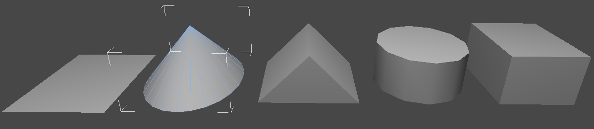
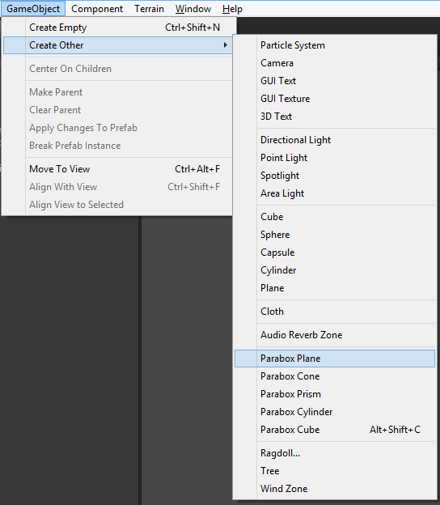
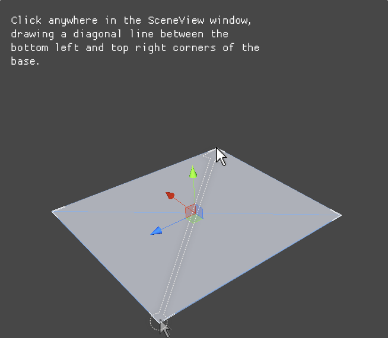
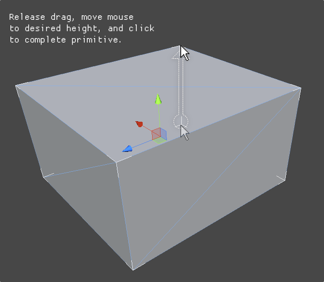
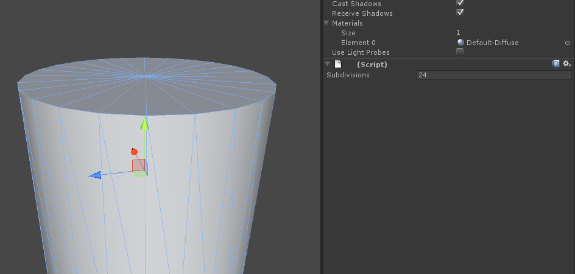

# Parabox Primitives

## Quick Start Steps

- Select `GameObject -> Create Other -> Parabox Cube (Alt-Shift-C)`

- Click and drag in the SceneView window.

- Release the drag, and move the cursor vertically.

- Click to finalize primitive size.

## Primitive Parameters

Some primitives provide an interface for modifying parameters post-initialization.  At this time, the `Cone` and `Cylinder` primitives expose their subdivisions parameter.  Changing this will increase or decrease the amount of subdivisions of your primitive.

## Additional Notes

You may notice that objects created using Parabox Primitives have a `(Script)` component attached.  This component does not have any performance implications, and only exists to ensure that meshes are not leaked when deleting it's parent `GameObject`.  You may safely remove this component if you like (though Unity will leak this mesh if you decide to delete the `GameObject` parent).

## Support

Feel free to email me [karl@paraboxstudios.com](mailto:karl@paraboxstudios.com) with any questions, bug reports, or feature requests. 

If you liked this Asset, check out [paraboxstudios.com](paraboxstudios.com) for more Unity stuff (free and otherwise).
